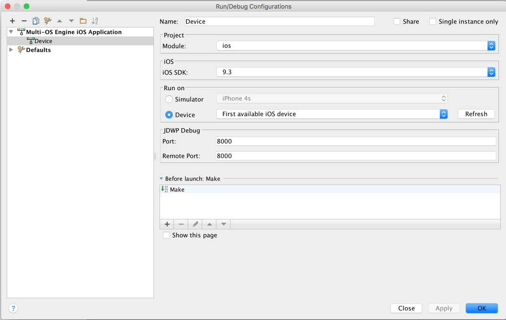

# bit6-moe-samples

1. Install [Multi-OS Engine](https://software.intel.com/en-us/multi-os-engine) v1.0.598
2. In Android Studio choose the option "import project (Eclipse ADT, Graddle, etc.) to import the sample project.
3. Add [Bit6.jar](https://www.dropbox.com/s/m2lriz4eqnxa2gu/Bit6.jar.zip?dl=0) into the lib folder
4. Add lib/Bit6.jar as a Module Library to the project.

	

5. Select "Edit Configurations" in the Run menu in Android Studio. Add a new "Intel MOE iOS Application" configuration to run on a Device.
	
	
	
	
	
	

6. Get your Bit6 api key in [Bit6 Dashboard](https://dashboard.bit6.com).

7. Open the file com.bit6.chatdemo.Main.java and set your api key in

	`Bit6.startWithApiKey("");`
	
8. Connect your iOS device and Run the project

####Enable the Push Notification

1. In Android Studio, do right clic on the Android side panel, select MOE Actions -> Open project in Xcode.

2. In Xcode change the bundle identifier of the application to match your apple account.

3. Generate the APNS Certificates for the bundle identifier you set in step8. https://developer.apple.com/account/. Install these certificates in your Mac.

4. Open the Keychain app in Mac and export the APNS Certificates as .p12 files. Upload these two .p12 files to [Bit6 Dashboard](https://dashboard.bit6.com).

####Try the Sample Project

1. Install the sample project in one device

2. Enter an username and a password. 

3. Tap "Sign Up" to create the account, or "Login" if the account already existed.

4. Repeat steps 1-3 in another device, using a different account.

#####To start a conversation

1. Tap the + sign in the demo running in device1

2. Enter the username of the account you are using in device2

3. Once you are inside the conversation you can:
	* use the "Call" button to start an audio or an audio+video call to deviceB
	* use the "compose" button to send a text message