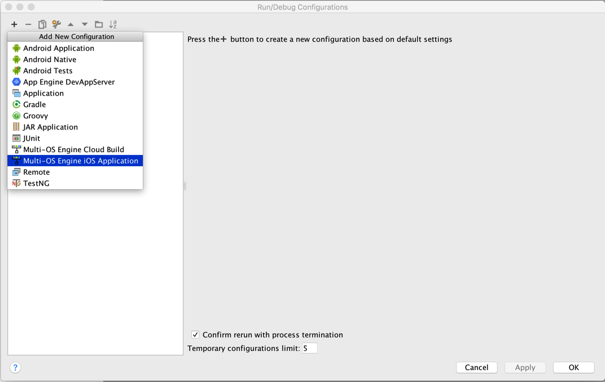

# bit6-moe-samples

1. Install [Multi-OS Engine](https://software.intel.com/en-us/multi-os-engine) v1.0.648

2. Clone the sample app `git clone https://github.com/bit6/bit6-moe-samples`.

3. In Android Studio choose the option "import project (Eclipse ADT, Graddle, etc.) to import the `Bit6FullDemo-Java` sample project.

4. Select "Edit Configurations" in the Run menu in Android Studio. Add a new "Multi-OS Engine iOS Application" configuration to run on a Device.
	
	
	
	
	
	

5. Get your Bit6 api key in [Bit6 Dashboard](https://dashboard.bit6.com).

6. Open the file com.bit6.chatdemo.Main.java and set your api key in

	`Bit6.startWithApiKey("");`
	
7. Open /ios/src/main/Info.plist and set your bundle identifier to match your Apple account.	
	
8. Open /ios/build.gradle and set `signingIdentity` and `provisioningProfile` to match your bundle identifier. In some cases this is not necessary because Xcode does it automatically.

9. Connect your iOS device and run the module.

####Enable the Push Notification

1. Generate the APNS Certificates for the bundle identifier you set in step8. https://developer.apple.com/account/. Install these certificates in your Mac.

2. Open the Keychain app in Mac and export the APNS Certificates as .p12 files. Upload these two .p12 files to [Bit6 Dashboard](https://dashboard.bit6.com).

####Try the Sample Project

1. Install the sample project in one device

2. Enter an username and a password. 

3. Tap "Sign Up" to create the account, or "Login" if the account already existed.

4. Repeat steps 1-3 in another device, using a different account.

#####To start a conversation

1. Tap the + sign in the demo running in device1

2. Enter the username of the account you are using in device2

3. Once you are inside the conversation you can:
	* use the "Call" button to start an audio or an audio+video call to deviceB
	* use the "compose" button to send a text message