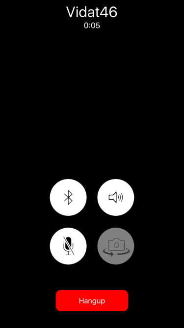

# Bit6 with Multi-OS Engine

## Prerequisites

* Get Bit6 API Key for your app from [Bit6 Dashboard](https://dashboard.bit6.com)

* Configure Push Notifications support for [iOS APNS](../guides/push-apns.md)

* Install [Multi-OS Engine](https://software.intel.com/en-us/multi-os-engine) v1.0.702


## Sample App
The easiest way to get started is using our [sample applications](https://github.com/bit6/bit6-moe-samples). Download or clone the repository to a local directory:

```sh
git clone https://github.com/bit6/bit6-moe-samples
```

# Development

* Launch Android Studio

* Select `Import Project (Eclipse ADT, Gradle, etc.)` to import the `Bit6FullDemo-Java` sample project.


## Project Configuration

1. Open `ios/src/main/Info.plist` and set the bundle identifier for your app. Make sure it matches the one used when configuring APNS push notifications.

2. Open `ios/build.gradle` and set `signingIdentity` and `provisioningProfile` to match your bundle identifier. In some cases this is not necessary because Xcode does it automatically.


## Set API Key

Edit `Main.java` and set your Bit6 API key in

```java
Bit6.startWithApiKey("myApiKey");
```


# Build and Run

## Run Configuration

Select `Edit Configurations` in the Run menu in Android Studio. Add a new "Multi-OS Engine iOS Application" configuration to run on a Device.


####Enable the Push Notification

1. Generate the APNS Certificates for the bundle identifier you set in step8. https://developer.apple.com/account/. Install these certificates in your Mac.

2. Open the Keychain app in Mac and export the APNS Certificates as .p12 files. Upload these two .p12 files to [Bit6 Dashboard](https://dashboard.bit6.com).

## Launch

Connect your iOS device and run the module.

# Using Sample App

The sample application allows you to create users and let them send text messages to each other as well as make voice and video calls.

Create a new user, or use an existing one.


## IP Messaging

Create a new chat 'Direct' or 'Group'


In the chat screen you can make video/voice calls, send/receive text messages, see typing notifications.


## Video/Voice Calling

Use button at the top of chat screen to make voice/video calls

